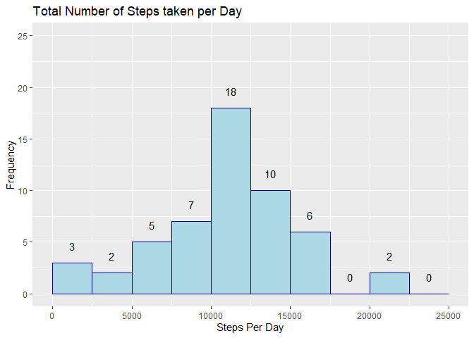
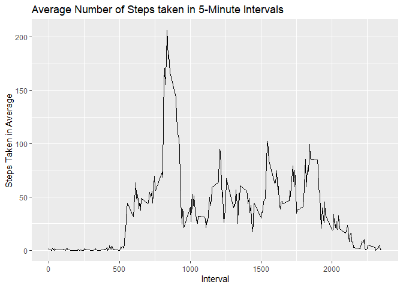
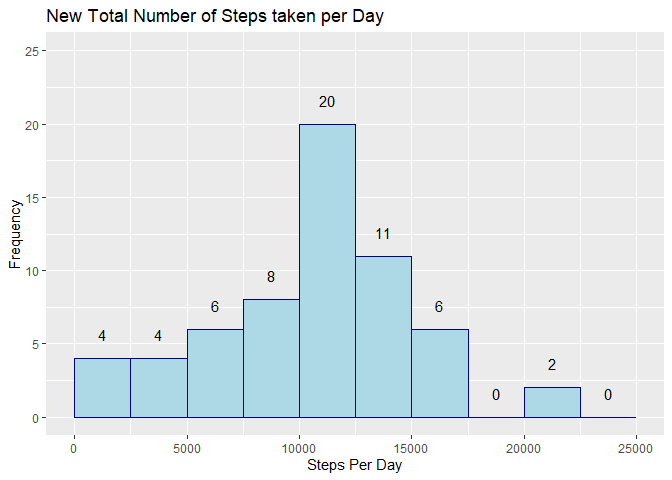
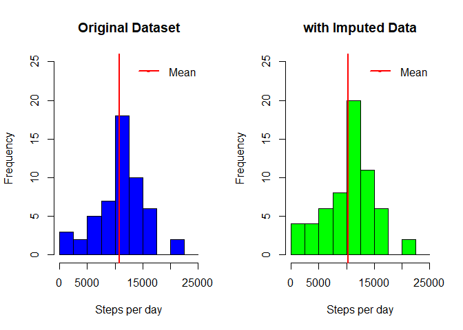
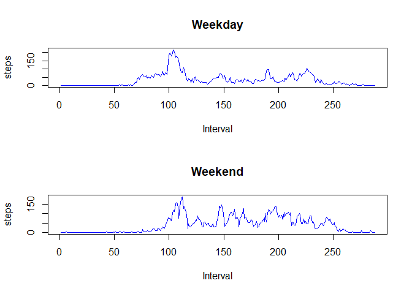

## Loading and preprocessing the data

```r
## Load libraries
library(dplyr)
library(ggplot2)

## Download zip datasets
fileURL <- "https://d396qusza40orc.cloudfront.net/repdata%2Fdata%2Factivity.zip"
download.file(fileURL, destfile = "ActivityMonitotingData.zip")
downloadDate <- date()
unzip(zipfile = "ActivityMonitotingData.zip")

## Read .csv file
activityData <- read.csv("./activity.csv", header = TRUE)
```

## What is mean total number of steps taken per day?

Calculate the total number of steps taken per day

```r
stepsPerDay <- activityData %>% 
        group_by(date) %>% 
        summarise(totalSteps = sum(steps))
```

Make a histogram of the total number of steps taken each day

```r
x_breaks <- seq(0, 25000, 2500)
ggplot(stepsPerDay, aes(x=totalSteps)) +
        # Add title and labels
        ggtitle("Total Number of Steps Taken per Day") + xlab("Steps Per Day") + ylab("Frequency") +
        # Add histogram
        geom_histogram(breaks = x_breaks, color="darkblue", fill="lightblue") +
        coord_cartesian(ylim=c(0,25)) +
        stat_bin(breaks = x_breaks, geom="text", aes(label=..count..), vjust=-1.5)
```




Calculate and report the mean and median of the total number of steps taken per day

```r
stepsPerDay %>% summarise(mean=mean(totalSteps, na.rm = TRUE), median=median(totalSteps, na.rm = TRUE)) %>%
        knitr::kable(format = "html", digits = 2, row.names = F, align = 'c',
                     col.names = c("Mean", "Median"))
```

<table>
 <thead>
  <tr>
   <th style="text-align:center;"> Mean </th>
   <th style="text-align:center;"> Median </th>
  </tr>
 </thead>
<tbody>
  <tr>
   <td style="text-align:center;"> 10766.19 </td>
   <td style="text-align:center;"> 10765 </td>
  </tr>
</tbody>
</table>


## What is the average daily activity pattern?
Make a time series plot of the 5-minute interval and average number of step taken, averaged across all days

```r
StepsTimeSeriesData <- activityData %>% 
        group_by(interval) %>% 
        summarise(total=sum(steps, na.rm=TRUE), average=mean(steps, na.rm = TRUE))

ggplot(StepsTimeSeriesData, aes(x=interval, y=average)) + geom_line() +
        ggtitle("Average Number of Steps Taken in 5-Minute Intervals") +
        xlab("Interval") + ylab("Steps Taken in Average")
```




Which 5-minute interval, on average, contains the maximum number of steps?

```r
StepsTimeSeriesData %>% 
        filter(average==max(average)) %>%
        knitr::kable(format = "html", digits = 2, row.names = F, align = 'c', 
                     col.names = c("Interval", "Mean", "Median"))
```

<table>
 <thead>
  <tr>
   <th style="text-align:center;"> Interval </th>
   <th style="text-align:center;"> Mean </th>
   <th style="text-align:center;"> Median </th>
  </tr>
 </thead>
<tbody>
  <tr>
   <td style="text-align:center;"> 835 </td>
   <td style="text-align:center;"> 10927 </td>
   <td style="text-align:center;"> 206.17 </td>
  </tr>
</tbody>
</table>

## Imputing missing values
Calculate and report the total number of missing values in the dataset, i.e. number of rows with NAs

```r
colSums(is.na(activityData)) # Total number of NAs in each column of the original dataset
```

```
##    steps     date interval 
##     2304        0        0
```

```r
colSums(is.na(stepsPerDay)) # Total number of days that contain NA values
```

```
##       date totalSteps 
##          0          8
```

Strategy for imputting NA values: All NA values are located in the "steps" column. Find the average number of steps on the previous and next day, on the same interval. Example: if one row with missing data is on 2012-10-15, interval 20, then average the values of 2012-10-14 and 2012-10-16, both from interval 20.

Find days with missing data (NAs)

```r
naDays <- activityData %>% group_by(date) %>% summarise(total=sum(steps)) %>% 
        filter(is.na(total)==TRUE) %>% select(date)
naDays
```

```
## # A tibble: 8 x 1
##   date      
##   <fct>     
## 1 2012-10-01
## 2 2012-10-08
## 3 2012-11-01
## 4 2012-11-04
## 5 2012-11-09
## 6 2012-11-10
## 7 2012-11-14
## 8 2012-11-30
```

Create a copy dataset

```r
data2 <- activityData
```

Find rows with missing data (NAs)

```r
naRows <- which(is.na(data2$steps))
```

Create a new dataset equal to the original but with missing data filled in

```r
minDate <- min(as.Date(data2$date))
maxDate <- max(as.Date(data2$date))
count <- 0
for (i in naRows) {
        prevDay <- as.Date(data2[i,"date"]) - 1
        nextDay <- as.Date(data2[i,"date"]) + 1
        if (as.Date(data2[i,"date"]) == minDate) {
                newStepsValue <- subset(data2, as.Date(date)==nextDay & interval==data2[i,"interval"])$steps
        } else if (as.Date(data2[i,"date"]) == maxDate) {
                newStepsValue <- subset(data2, as.Date(date)==prevDay & interval==data2[i,"interval"])$steps
        } else {
                stepsDay1 <- subset(data2, as.Date(date)==prevDay & interval==data2[i,"interval"])$steps
                stepsDay2 <- subset(data2, as.Date(date)==nextDay & interval==data2[i,"interval"])$steps
                newStepsValue <- mean(c(stepsDay1, stepsDay2), na.rm = TRUE)
        }
        data2[i,"steps"] <- newStepsValue
        count <- count + 1
}
```

Check results

```r
colSums(is.na(data2))
```

```
##    steps     date interval 
##        0        0        0
```

Make a histogram of the total number of steps taken each day and calculate and report the mean and median taken per day. 

```r
newDailySteps <- data2 %>% group_by(date) %>% summarise(totalSteps=sum(steps))
x_breaks <- seq(0, 25000, 2500)
ggplot(newDailySteps, aes(x=totalSteps)) +
        # Add title and labels
        ggtitle("New Total Number of Steps Taken per Day") + xlab("Steps Per Day") + ylab("Frequency") +
        # Add histogram
        geom_histogram(breaks = x_breaks, color="darkblue", fill="lightblue") +
        coord_cartesian(ylim=c(0,25)) +
        stat_bin(breaks = x_breaks, geom="text", aes(label=..count..), vjust=-1.5)
```



```r
par(mfrow=c(1,2))
hist(stepsPerDay$totalSteps, col="blue", breaks = x_breaks, ylim=c(0,25), xlab = "Steps per Day",
     ylab= "Frequency", main = "Original Dataset")
abline(v=mean(stepsPerDay$totalSteps, na.rm = TRUE), col="red", lwd=2)
legend("topright", pch="-", lwd=2, col=c("red"), legend=c("Mean"), 
       box.col="white", inset = .02)
hist(newDailySteps$totalSteps, col="green", breaks = x_breaks, ylim=c(0,25), xlab = "Steps per Day",
     ylab= "Frequency", main = "with Imputed Data")
abline(v=mean(newDailySteps$totalSteps, na.rm = TRUE), col="red", lwd=2)
legend("topright", pch="-", lwd=2, col=c("red"), legend=c("Mean"), 
       box.col="white", inset = .02)
```



Report mean and medians

```r
t1 <- stepsPerDay %>% summarise(mean=mean(totalSteps, na.rm = TRUE), median=median(totalSteps, na.rm = TRUE))
t2 <- newDailySteps %>% summarise(mean=mean(totalSteps, na.rm = TRUE), median=median(totalSteps, na.rm = TRUE))
knitr::kable(list(t1,t2),format = "markdown", digits = 2, row.names = F, align = 'c', col.names = c("Mean", "Median"))
```


|   Mean   | Median |
|:--------:|:------:|
| 10766.19 | 10765  |

|   Mean   | Median |
|:--------:|:------:|
| 10295.52 | 10571  |


## Are there differences in activity patterns between weekdays and weekends?
Create new factor variable with two levels (weekday, weekend)

```r
data2 <- cbind(data2, dayWk=factor(ifelse(weekdays(as.Date(data2$date)) %in% c("Saturday", "Sunday"), "weekend", "weekday")))

wkDayStepTimeSeries <- data2 %>% filter(dayWk=="weekday") %>% group_by(interval) %>% summarise(total=sum(steps), average=mean(steps))
wkEndStepTimeSeries <- data2 %>% filter(dayWk=="weekend") %>% group_by(interval) %>% summarise(total=sum(steps), average=mean(steps))

par(mfrow=c(2,1))
plot(wkDayStepTimeSeries$average, type="l", col="blue", xlab="Interval", ylab = "Steps", main = "Weekday")
plot(wkEndStepTimeSeries$average, type="l", col="blue", xlab="Interval", ylab = "Steps", main = "Weekend")
```


